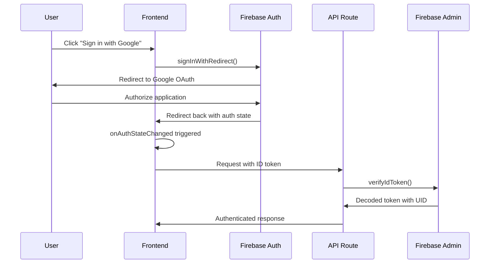
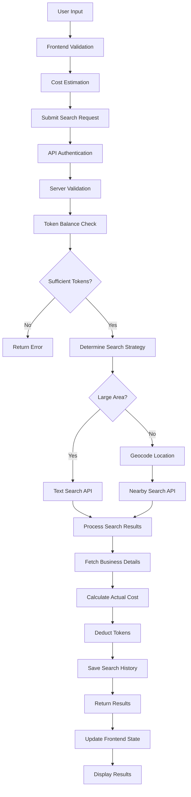
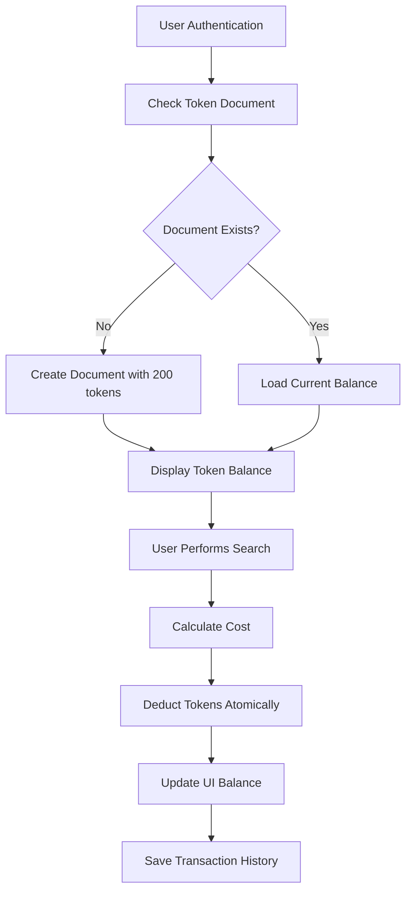

# B2Lead System Design Document

## Table of Contents
1. [Overview](#overview)
2. [Architecture](#architecture)
3. [Frontend Design](#frontend-design)
4. [Backend Design](#backend-design)
5. [Database Schema](#database-schema)
6. [Authentication & Authorization](#authentication--authorization)
7. [Business Logic](#business-logic)
8. [API Integration](#api-integration)
9. [Data Flow](#data-flow)
10. [Security](#security)
11. [Performance](#performance)
12. [Deployment](#deployment)

## Overview

### Purpose
B2Lead is a lead generation platform designed for web design and development professionals. It helps users discover local businesses, particularly those without websites (high-value prospects), and export their contact information for outreach campaigns.

### Core Value Proposition
- **Intelligent Business Discovery**: Smart search across Google Places API
- **Lead Qualification**: Automatically identifies businesses without websites
- **Contact Enrichment**: Provides phone, address, ratings, and photos
- **Export Capabilities**: CSV/Excel export for CRM integration
- **Fair-Use Pricing**: Token-based system to manage API costs

### Technology Stack
- **Frontend**: Next.js 15, TypeScript, Tailwind CSS, Framer Motion
- **Backend**: Next.js API Routes (serverless functions)
- **Database**: Firebase Firestore
- **Authentication**: Firebase Auth with Google OAuth
- **External APIs**: Google Maps Places API
- **Deployment**: Vercel (primary), Nginx (alternative)

## Architecture

### High-Level Architecture
```
┌─────────────────┐    ┌─────────────────┐    ┌─────────────────┐
│   Web Browser   │    │   Next.js App   │    │  Firebase Auth  │
│                 │◄──►│   (Frontend)    │◄──►│   & Firestore   │
└─────────────────┘    └─────────────────┘    └─────────────────┘
                                │
                                ▼
                        ┌─────────────────┐    ┌─────────────────┐
                        │  API Routes     │    │ Google Places   │
                        │  (Backend)      │◄──►│     API         │
                        └─────────────────┘    └─────────────────┘
```

### System Architecture Principles
1. **Serverless-First**: Leverages Next.js API routes for scalable backend
2. **Component-Based**: Modular React components with clear responsibilities
3. **Type Safety**: Full TypeScript implementation
4. **Real-Time Data**: Firebase integration for instant updates
5. **Progressive Enhancement**: Works without JavaScript for core features

## Frontend Design

### Project Structure
```
frontend/src/
├── app/                    # Next.js 15 App Router
│   ├── api/               # Backend API routes
│   ├── auth/              # Authentication pages
│   ├── dashboard/         # Protected dashboard area
│   │   ├── layout.tsx     # Dashboard layout with sidebar
│   │   ├── page.tsx       # Dashboard home
│   │   ├── search/        # Search functionality
│   │   ├── leads/         # Lead management
│   │   └── tokens/        # Token management
│   ├── globals.css        # Global styles
│   ├── layout.tsx         # Root layout
│   └── page.tsx           # Landing page
├── components/            # Reusable UI components
│   ├── ui/               # Base UI components (shadcn/ui)
│   ├── AuthProvider.tsx  # Authentication context
│   ├── Navbar.tsx        # Navigation component
│   ├── TokenDisplay.tsx  # Token balance display
│   └── DataTable.tsx     # Advanced data table
├── services/             # API service layers
│   ├── tokenService.ts   # Token operations
│   ├── adminTokenService.ts # Server-side token ops
│   └── query.ts          # Search query operations
├── lib/                  # Utilities and types
│   ├── types.ts          # TypeScript definitions
│   ├── utils.ts          # Utility functions
│   └── firebase-admin.ts # Firebase admin config
└── firebase/             # Firebase client config
    └── config.ts
```

### Key Components

#### 1. AuthProvider (Context Management)
```typescript
// Handles authentication state and Google OAuth flow
interface AuthContextType {
  user: User | null;
  loading: boolean;
  signInWithGoogle: () => Promise<UserCredential | null>;
  signOut: () => Promise<void>;
  authError: AuthError | null;
}
```

**Responsibilities**:
- Manages Firebase authentication state
- Handles Google OAuth redirect flow
- Provides authentication context to entire app
- Handles token document creation for new users

#### 2. Dashboard Layout
```typescript
// Sidebar-based dashboard layout with navigation
export default function DashboardLayout({
  children
}: {
  children: React.ReactNode;
})
```

**Features**:
- Collapsible sidebar navigation
- Token display integration
- User profile section
- Responsive design for mobile/desktop

#### 3. Search Interface
```typescript
// Multi-parameter business search with cost estimation
interface SearchFormProps {
  onSearchStart: () => void;
  onSearchComplete: (data: SearchResponse) => void;
  onSearchError: (error: string) => void;
}
```

**Capabilities**:
- Real-time cost estimation
- Parameter validation
- Token balance checking
- Location autocomplete suggestions

#### 4. DataTable Component
**Features**:
- Server-side pagination
- Multi-column sorting
- Advanced filtering (name, website status)
- Bulk selection and export
- Responsive design

#### 5. TokenDisplay Component
**Features**:
- Real-time balance updates
- Loading states
- Integration with sidebar and navbar
- Responsive design for different layouts

## Backend Design

### API Routes Structure
```
/api/
├── search              # POST - Main business search
├── tokens/
│   ├── balance        # GET - Token balance retrieval
│   └── add            # POST - Add tokens (payment integration)
└── test-admin         # GET - Admin functionality testing
```

### Key API Endpoints

#### 1. Search Endpoint (`/api/search`)
```typescript
// POST /api/search
interface SearchRequest {
  keyword: string;        // Business type (e.g., "roofing")
  location: string;       // Geographic location
  radius: number;         // Search radius in meters
  max_results: number;    // Maximum results to return
}

interface SearchResponse {
  success: boolean;
  businesses: Business[];
  meta: {
    search_performed: string;
    results_found: number;
    tokens_used: number;
    remaining_tokens: number;
    search_strategy: 'text' | 'nearby';
  };
}
```

**Process Flow**:
1. Authenticate user via Firebase ID token
2. Validate input parameters
3. Check user's token balance
4. Determine search strategy (text vs. nearby)
5. Execute Google Places API search
6. Fetch detailed business information
7. Calculate and deduct tokens
8. Save search history
9. Return results with metadata

#### 2. Token Balance Endpoint (`/api/tokens/balance`)
```typescript
// GET /api/tokens/balance
interface TokenBalanceResponse {
  success: boolean;
  balance: number;
}
```

**Process Flow**:
1. Verify Firebase ID token
2. Query Firestore for user's token document
3. Return current balance
4. Create document with 200 tokens if new user

### Service Layer Architecture

#### 1. AdminTokenService
```typescript
export class AdminTokenService {
  static async getTokenBalance(userId: string): Promise<number>
  static async deductTokens(userId: string, amount: number): Promise<number>
  static async addTokens(userId: string, amount: number): Promise<number>
}
```

**Features**:
- Server-side only operations
- Firebase Admin SDK integration
- Atomic transactions for token operations
- Error handling and validation

#### 2. Search Strategy Engine
```typescript
// Intelligent search strategy selection
const determineSearchStrategy = (location: string, radius: number) => {
  const largeAreaKeywords = ['province', 'state', 'country', 'ontario', 'california'];
  const isLargeArea = largeAreaKeywords.some(keyword => 
    location.toLowerCase().includes(keyword)
  );
  
  return (isLargeArea || radius > 25000) ? 'text' : 'nearby';
};
```

## Database Schema

### Firebase Firestore Collections

#### 1. `tokens` Collection
```typescript
interface TokenDocument {
  userId: string;          // Firebase Auth UID (document ID)
  balance: number;         // Current token count
  createdAt: Date;        // Account creation timestamp
  lastUpdated: Date;      // Last balance modification
}

// Document path: /tokens/{userId}
```

#### 2. `searchQueries` Collection
```typescript
interface SearchQueryDocument {
  id: string;             // Auto-generated document ID
  userId: string;         // Firebase Auth UID
  searchTerm: string;     // Original search keyword
  location: string;       // Search location
  timestamp: Timestamp;   // Search execution time
  resultCount: number;    // Number of results found
  tokensUsed: number;     // Tokens consumed
  results: Business[];    // Array of business results
}

// Document path: /searchQueries/{queryId}
```

#### 3. Business Data Model
```typescript
interface Business {
  place_id: string;           // Google Places unique ID
  name: string;              // Business name
  address: string;           // Formatted address
  phone?: string;            // Phone number (if available)
  website?: string;          // Website URL (if available)
  maps_url?: string;         // Google Maps URL
  business_status?: string;  // OPERATIONAL, CLOSED_TEMPORARILY, etc.
  total_reviews?: number;    // Number of Google reviews
  rating?: number;           // Star rating (1-5)
  image_url?: string;        // Business photo URL
  types?: string[];          // Google Places types
  price_level?: number;      // Price level (0-4)
}
```

## Authentication & Authorization

### Authentication Flow


### Authorization Strategy
1. **Client-Side**: Firebase Auth manages user sessions
2. **Server-Side**: All API routes verify Firebase ID tokens
3. **Token-Based**: Each request includes `Authorization: Bearer <token>`
4. **User Isolation**: All data operations scoped to authenticated user ID

### Security Measures
- **Token Expiration**: Firebase ID tokens auto-expire and refresh
- **HTTPS Only**: All authentication flows require HTTPS
- **CORS Protection**: Next.js built-in CORS handling
- **Input Validation**: Server-side parameter validation
- **Rate Limiting**: Token-based cost controls prevent abuse

## Business Logic

### Search Strategy Intelligence

#### 1. Location Processing
```typescript
const enhanceLocation = (location: string): string => {
  const cleanLocation = location.trim();
  
  // Add country context for Canadian provinces
  if (['ontario', 'quebec', 'alberta', 'british columbia'].includes(cleanLocation.toLowerCase())) {
    return `${cleanLocation}, Canada`;
  }
  
  // Add context for US states
  if (US_STATES.includes(cleanLocation.toLowerCase())) {
    return `${cleanLocation}, USA`;
  }
  
  return cleanLocation;
};
```

#### 2. Search Strategy Selection
```typescript
const isLargeAreaSearch = (location: string, radius: number): boolean => {
  const largeAreaIndicators = [
    'province', 'state', 'country', 'nation',
    'ontario', 'quebec', 'california', 'texas'
  ];
  
  const containsLargeAreaKeyword = largeAreaIndicators.some(keyword =>
    location.toLowerCase().includes(keyword)
  );
  
  return containsLargeAreaKeyword || radius > 25000; // 25km threshold
};
```

### Cost Calculation Engine
```typescript
interface PricingConfig {
  BASE_SEARCH_COST: 1;      // Fixed cost per search
  COST_PER_RESULT: 1;       // Variable cost per result
  MIN_CHARGE: 5;            // Minimum charge per search
  MAX_RESULTS_LIMIT: 100;   // Maximum results per search
}

const calculateCost = (actualResults: number): number => {
  const baseCost = PRICING_CONFIG.BASE_SEARCH_COST;
  const resultCost = actualResults * PRICING_CONFIG.COST_PER_RESULT;
  const totalCost = baseCost + resultCost;
  
  return Math.max(totalCost, PRICING_CONFIG.MIN_CHARGE);
};
```

### Lead Qualification Logic
```typescript
const qualifyLead = (business: Business): LeadQuality => {
  const score = {
    hasWebsite: business.website ? 0 : 10,      // No website = high value
    hasPhone: business.phone ? 5 : 0,           // Phone available = good
    reviewCount: business.total_reviews > 10 ? 3 : 0,  // Established business
    rating: business.rating > 4.0 ? 2 : 0,     // High rating = quality
    isOperational: business.business_status === 'OPERATIONAL' ? 5 : 0
  };
  
  const totalScore = Object.values(score).reduce((sum, val) => sum + val, 0);
  
  if (totalScore >= 15) return 'HIGH';
  if (totalScore >= 10) return 'MEDIUM';
  return 'LOW';
};
```

## API Integration

### Google Places API Integration

#### 1. Search APIs Used
```typescript
// Text Search - for large geographical areas
const textSearchUrl = `https://maps.googleapis.com/maps/api/place/textsearch/json?query=${keyword} in ${location}&key=${apiKey}`;

// Nearby Search - for specific coordinates
const nearbySearchUrl = `https://maps.googleapis.com/maps/api/place/nearbysearch/json?location=${lat},${lng}&radius=${radius}&keyword=${keyword}&key=${apiKey}`;

// Place Details - for comprehensive business information
const detailsUrl = `https://maps.googleapis.com/maps/api/place/details/json?place_id=${placeId}&fields=name,formatted_address,formatted_phone_number,website,business_status,rating,user_ratings_total,photos&key=${apiKey}`;
```

#### 2. Error Handling Strategy
```typescript
const handleGoogleApiError = (error: any, context: string) => {
  if (error.response?.status === 429) {
    throw new Error('Rate limit exceeded. Please try again later.');
  }
  
  if (error.response?.status === 403) {
    throw new Error('API quota exceeded or invalid API key.');
  }
  
  throw new Error(`Search failed: ${context}`);
};
```

#### 3. Rate Limiting
- **Request Throttling**: 10 requests per second limit
- **Quota Management**: Daily quota monitoring
- **Retry Logic**: Exponential backoff for rate limit errors
- **Batch Processing**: Multiple place IDs in single details request

## Data Flow

### Complete Search Flow


### Token Management Flow


## Security

### Security Measures

#### 1. Authentication Security
```typescript
// Server-side token verification
const verifyAuthToken = async (authHeader: string) => {
  if (!authHeader?.startsWith('Bearer ')) {
    throw new Error('Invalid authorization header');
  }
  
  const idToken = authHeader.split('Bearer ')[1];
  const decodedToken = await adminAuth.verifyIdToken(idToken);
  
  return decodedToken.uid;
};
```

#### 2. Input Validation
```typescript
const validateSearchParams = (params: any) => {
  const { keyword, location, radius, max_results } = params;
  
  if (!keyword?.trim()) {
    throw new Error('Keyword is required');
  }
  
  if (!location?.trim()) {
    throw new Error('Location is required');
  }
  
  if (radius < 1000 || radius > 50000) {
    throw new Error('Radius must be between 1km and 50km');
  }
  
  if (max_results < 1 || max_results > 100) {
    throw new Error('Max results must be between 1 and 100');
  }
};
```

#### 3. Environment Variables
```bash
# Firebase Configuration
NEXT_PUBLIC_FIREBASE_API_KEY=
NEXT_PUBLIC_FIREBASE_AUTH_DOMAIN=
NEXT_PUBLIC_FIREBASE_PROJECT_ID=
FIREBASE_PROJECT_ID=
FIREBASE_CLIENT_EMAIL=
FIREBASE_PRIVATE_KEY=

# Google Places API
GOOGLE_PLACES_API_KEY=

# Application
NEXT_PUBLIC_API_URL=
```

#### 4. CORS and Headers
```typescript
// API route security headers
export async function POST(request: NextRequest) {
  const response = NextResponse.json(data);
  
  response.headers.set('X-Content-Type-Options', 'nosniff');
  response.headers.set('X-Frame-Options', 'DENY');
  response.headers.set('X-XSS-Protection', '1; mode=block');
  
  return response;
}
```

## Performance

### Frontend Performance

#### 1. Code Splitting
```typescript
// Dynamic imports for heavy components
const DataTable = dynamic(() => import('@/components/DataTable'), {
  loading: () => <TableSkeleton />,
  ssr: false
});
```

#### 2. Caching Strategy
```typescript
// React Query for API state management
const { data: tokenBalance, refetch } = useQuery({
  queryKey: ['tokenBalance'],
  queryFn: getTokenBalance,
  staleTime: 5 * 60 * 1000, // 5 minutes
  refetchOnWindowFocus: false
});
```

#### 3. Image Optimization
```typescript
// Next.js Image component with optimization
<Image
  src={business.image_url}
  alt={business.name}
  width={100}
  height={100}
  className="rounded-lg"
  loading="lazy"
/>
```

### Backend Performance

#### 1. Database Optimization
```typescript
// Firestore compound indexes for complex queries
// Index: (userId, timestamp DESC) for search history
// Index: (userId) for token operations
```

#### 2. API Response Optimization
```typescript
// Minimal response payload
const optimizeBusinessData = (businesses: Business[]) => {
  return businesses.map(business => ({
    place_id: business.place_id,
    name: business.name,
    address: business.address,
    phone: business.phone,
    website: business.website,
    rating: business.rating,
    // Exclude heavy fields for list view
  }));
};
```

#### 3. Concurrent Processing
```typescript
// Parallel API requests for business details
const fetchBusinessDetails = async (placeIds: string[]) => {
  const chunks = chunkArray(placeIds, 10); // Process in batches of 10
  
  const results = await Promise.all(
    chunks.map(chunk => 
      Promise.all(chunk.map(placeId => fetchPlaceDetails(placeId)))
    )
  );
  
  return results.flat();
};
```

## Deployment

### Production Deployment

#### 1. Vercel Configuration
```json
{
  "builds": [
    {
      "src": "next.config.js",
      "use": "@vercel/next"
    }
  ],
  "env": {
    "NEXT_PUBLIC_FIREBASE_API_KEY": "@firebase_api_key",
    "GOOGLE_PLACES_API_KEY": "@google_places_api_key"
  }
}
```

#### 2. Environment Setup
```bash
# Production environment variables
NODE_ENV=production
NEXT_PUBLIC_API_URL=https://your-domain.com
GOOGLE_PLACES_API_KEY=your_google_api_key
FIREBASE_PROJECT_ID=your_firebase_project
```

#### 3. Build Optimization
```javascript
// next.config.js
const nextConfig = {
  experimental: {
    turbopack: true,
  },
  images: {
    domains: ['maps.googleapis.com', 'lh3.googleusercontent.com'],
  },
  env: {
    CUSTOM_KEY: process.env.CUSTOM_KEY,
  }
};
```

### Monitoring and Analytics

#### 1. Error Tracking
```typescript
// Client-side error boundary
class ErrorBoundary extends React.Component {
  componentDidCatch(error: Error, errorInfo: ErrorInfo) {
    console.error('Application error:', error, errorInfo);
    // Send to monitoring service
  }
}
```

#### 2. Performance Monitoring
```typescript
// API performance tracking
const trackApiPerformance = (endpoint: string, duration: number) => {
  console.log(`API ${endpoint} took ${duration}ms`);
  // Send to analytics service
};
```

## Conclusion

This system design provides a comprehensive overview of the B2Lead application architecture. The application successfully combines modern web technologies with intelligent business logic to create a valuable tool for lead generation professionals.

### Key Strengths
1. **Scalable Architecture**: Serverless design supports automatic scaling
2. **Type Safety**: Full TypeScript implementation prevents runtime errors
3. **Real-time Features**: Firebase integration provides instant updates
4. **Intelligent Search**: Smart strategy selection optimizes API usage
5. **User Experience**: Responsive design with progressive enhancement

### Areas for Future Enhancement
1. **Payment Integration**: Stripe integration for token purchases
2. **Advanced Analytics**: Detailed search performance analytics
3. **CRM Integration**: Direct export to popular CRM systems
4. **Mobile App**: Native mobile application for field use
5. **AI Enhancement**: Machine learning for lead scoring

This documentation should provide you with a solid understanding of the system architecture and enable you to continue development independently without relying on AI assistance.